# ELUXR v3 — Full System Architecture Flow

## High-Level App Flow

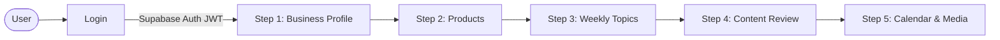

## Authentication Flow

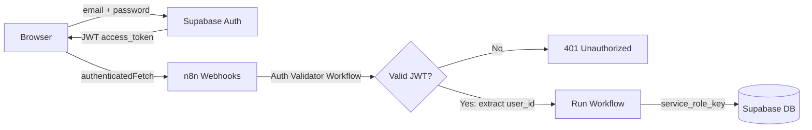

## Step 1: Define Your Business Profile

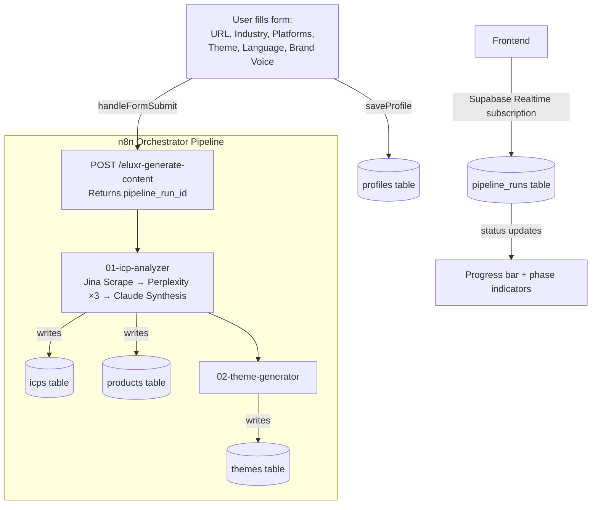

## Step 2: Your Products

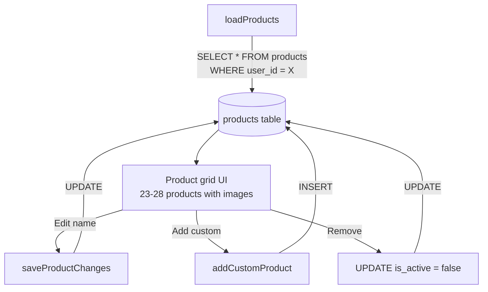

## Step 3: Weekly Topics Generation

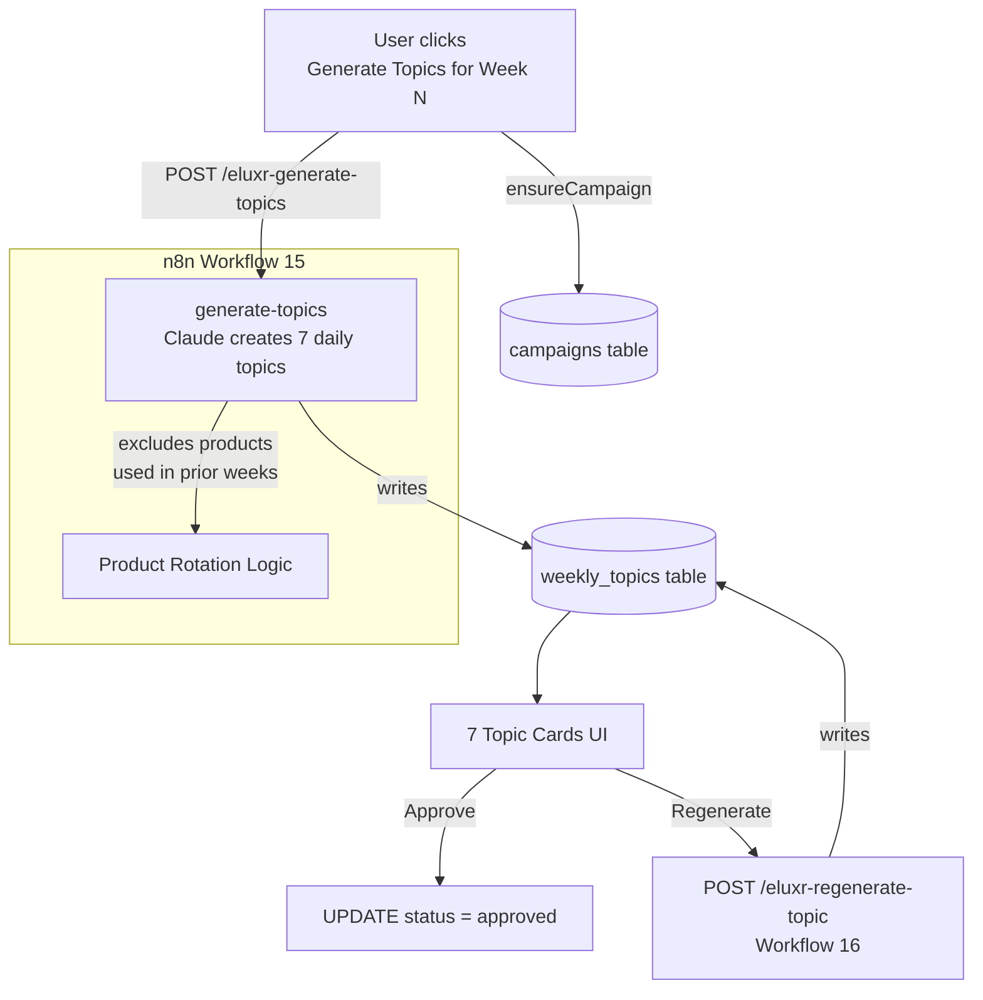

## Step 4: Content Review

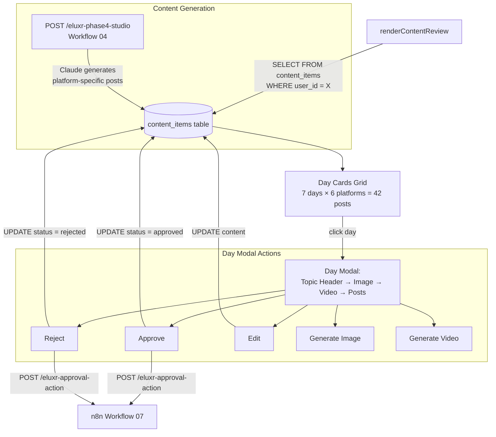

## Step 5: Calendar & Media Generation

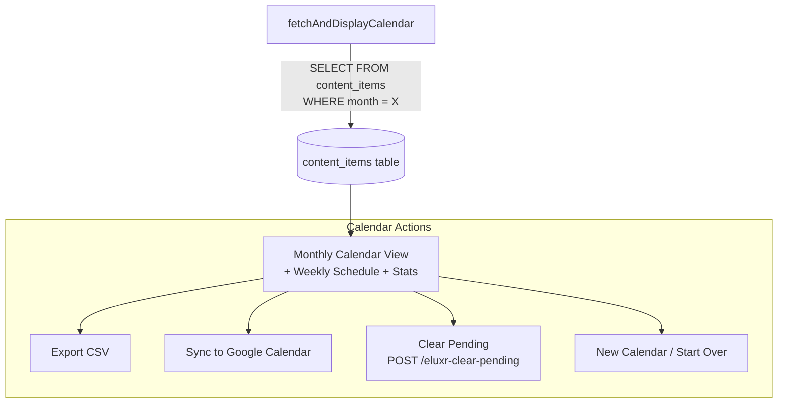

## Image Generation Flow (New Workflow)

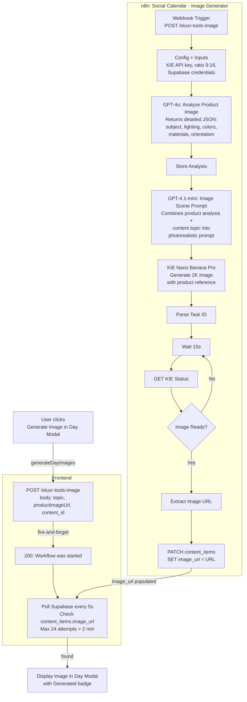

## Video Generation Flow

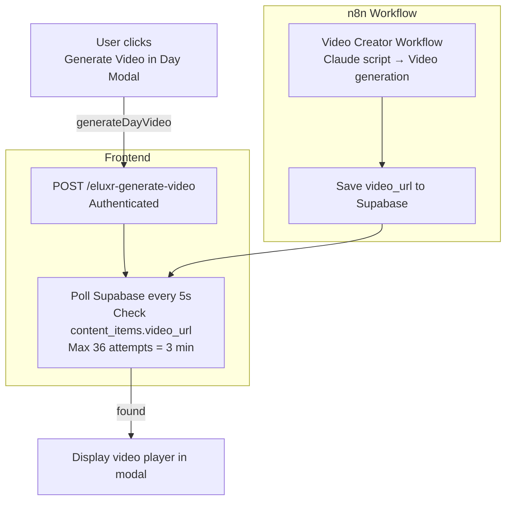

## Complete Data Model

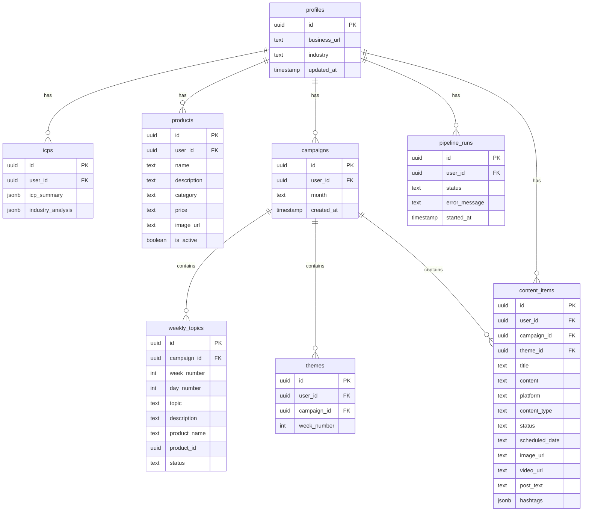

## N8N Webhook Endpoints Summary

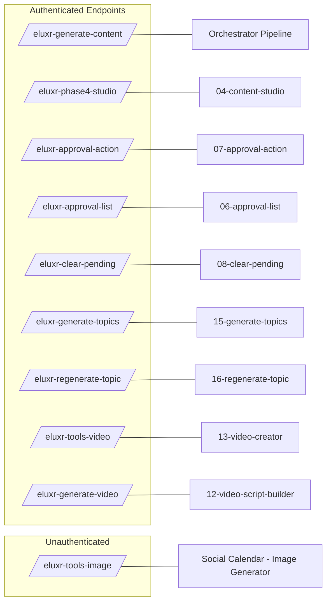

## Tech Stack

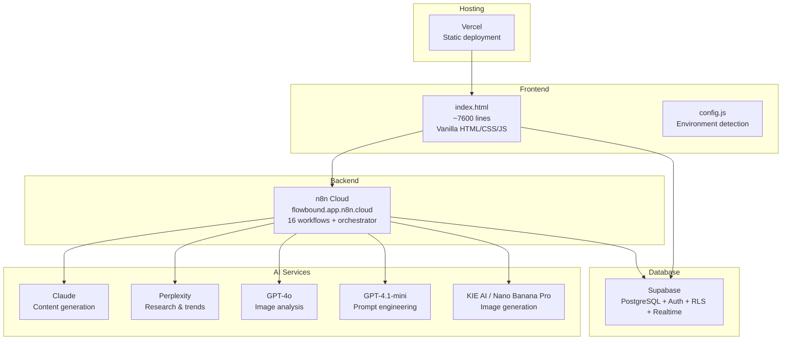
