# ELUXR v3 — User Experience Flow Map

> Every feature, action, and interaction a user can take — mapped with descriptions.

## Complete User Journey

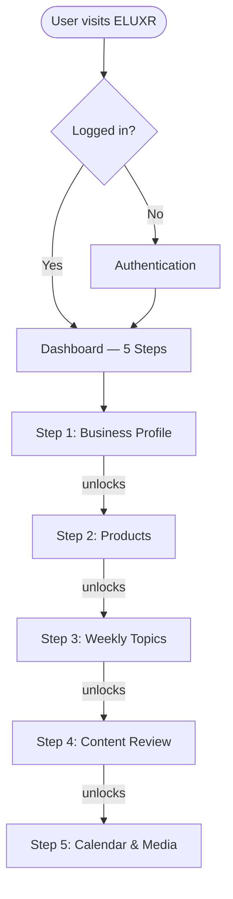

## Authentication Flow

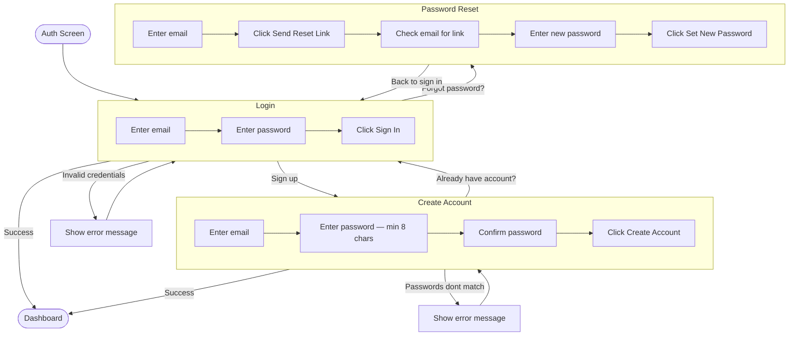

## Header — Always Visible

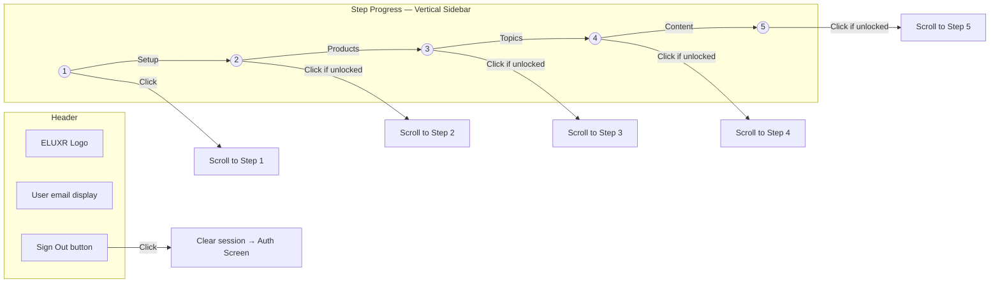

## Step 1: Define Your Business Profile

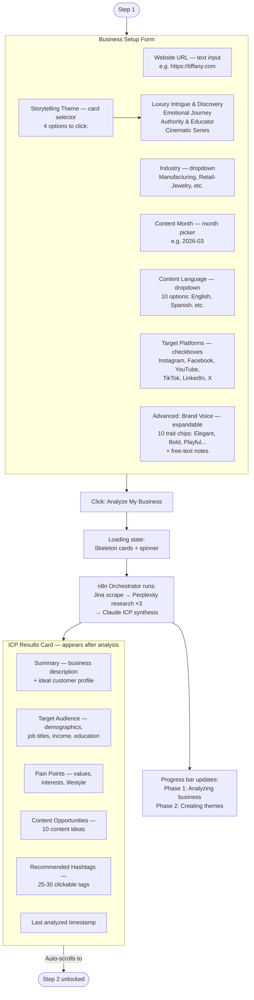

## Step 2: Your Products

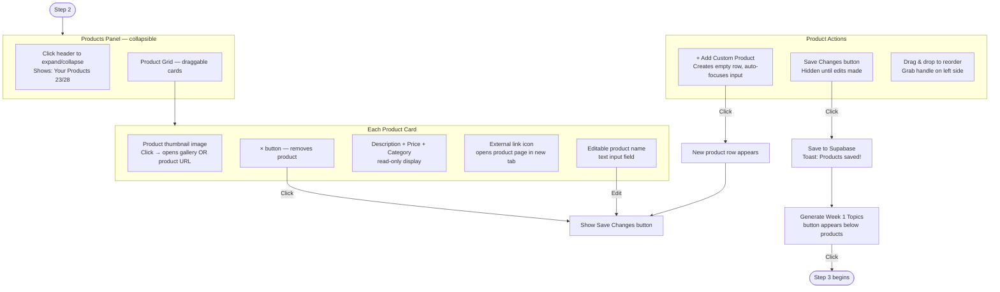

## Product Gallery Modal

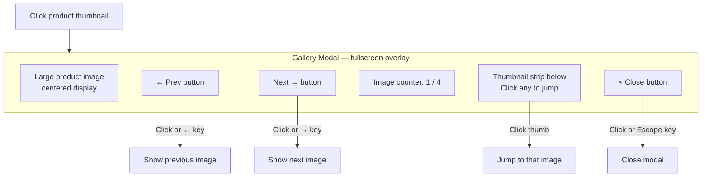

## Step 3: Weekly Topics

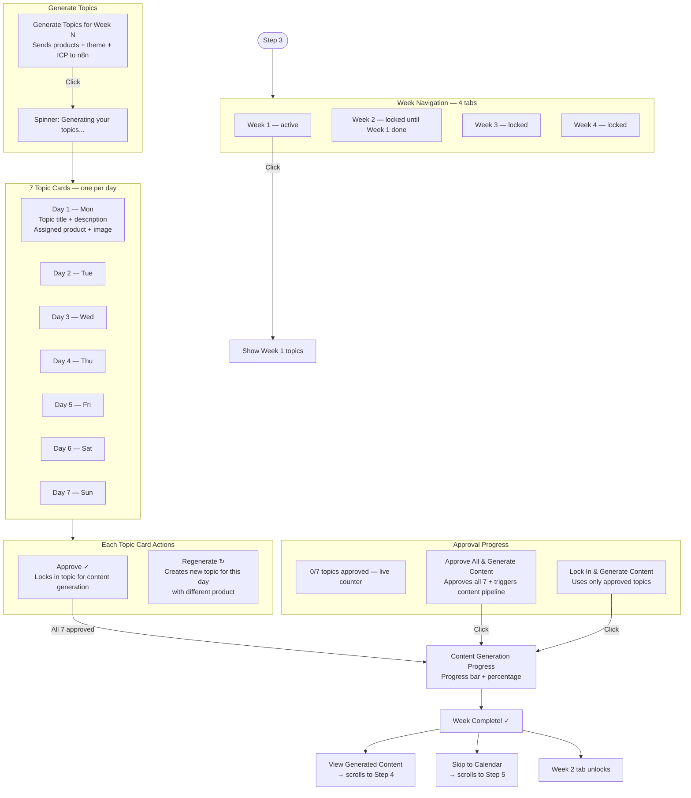

## Step 4: Content Review

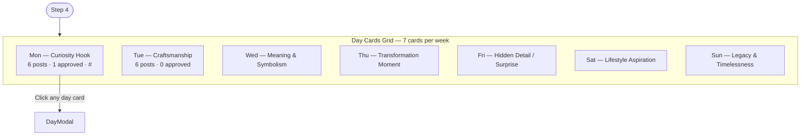

## Day Modal — Content Detail View

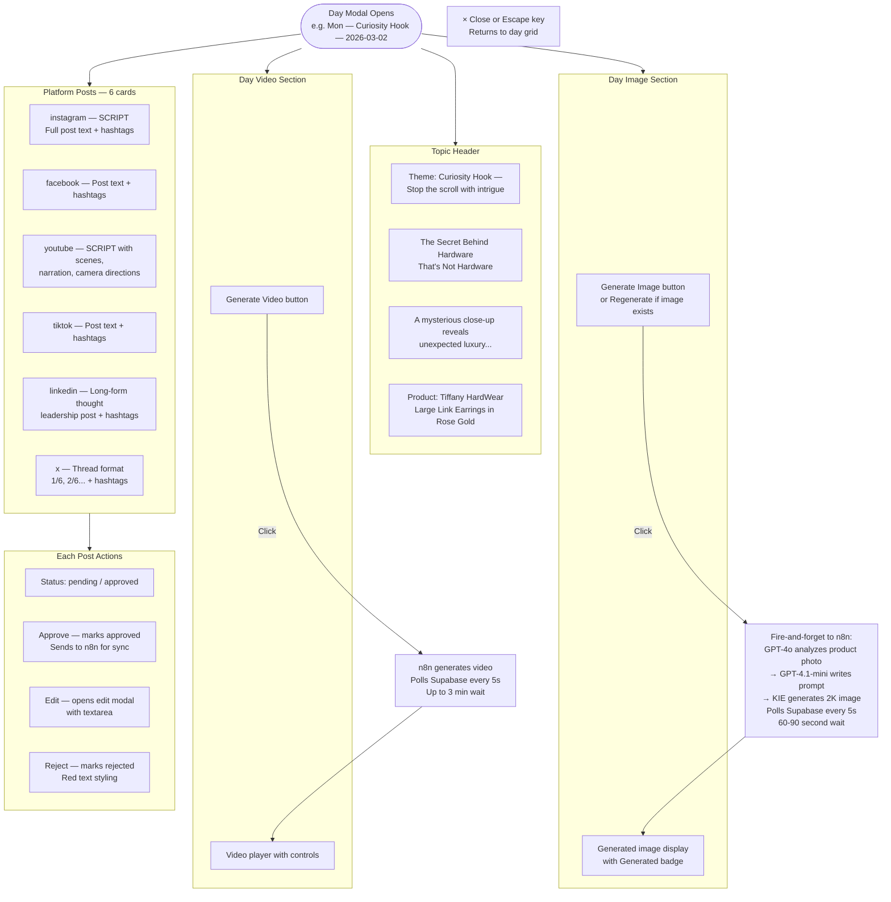

## Content Edit Modal

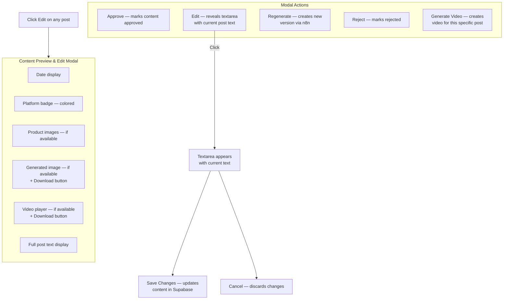

## Step 5: Calendar & Media

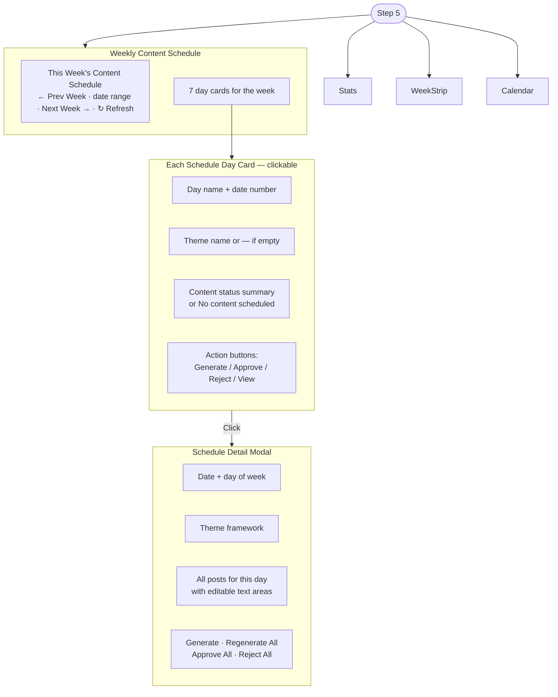

## Statistics & Content List

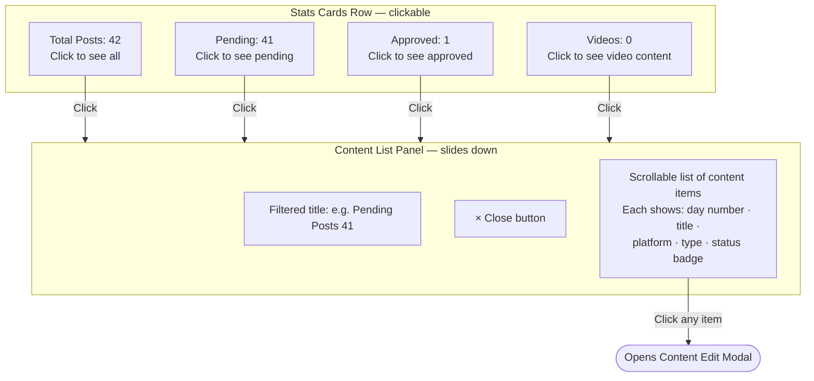

## Calendar View

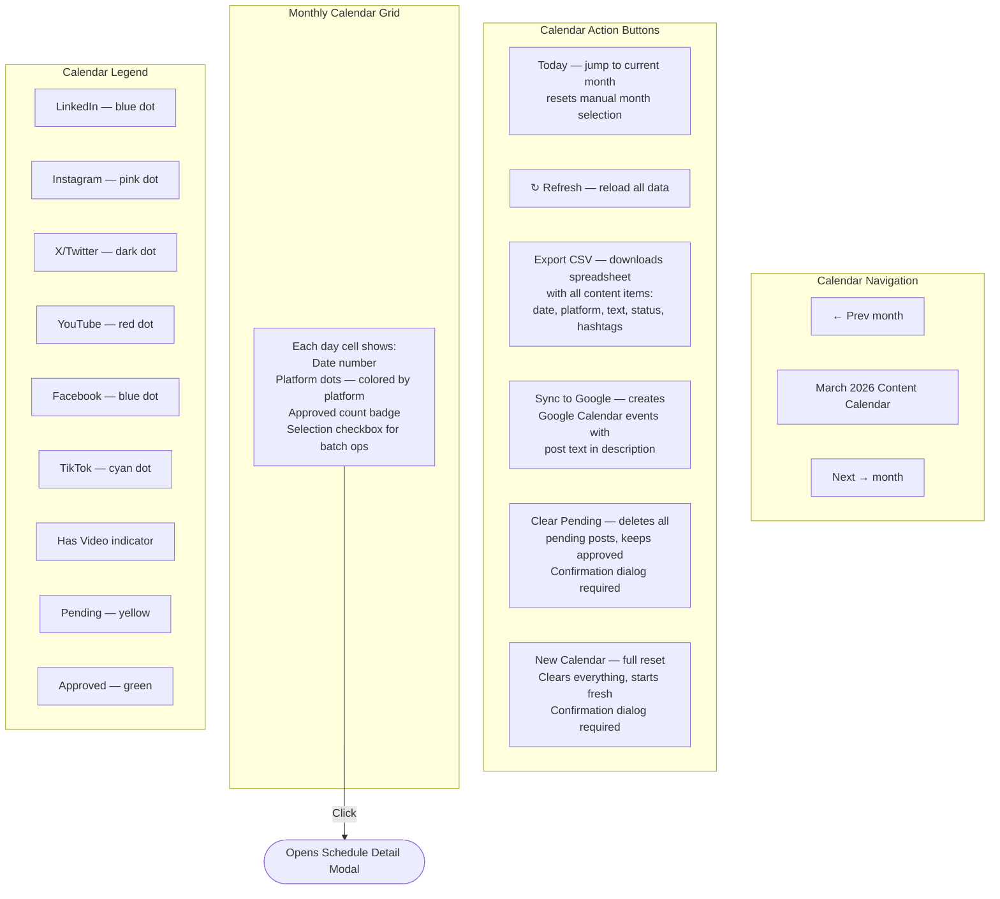

## Week View Strip

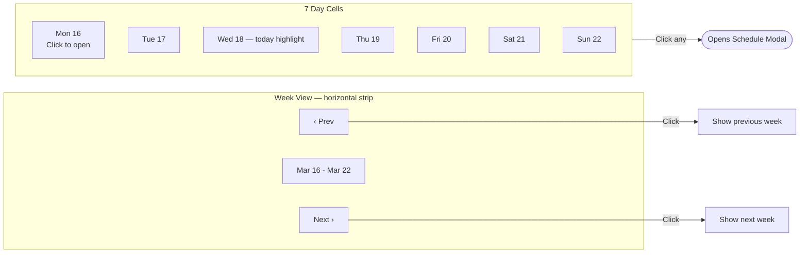

## Batch Operations

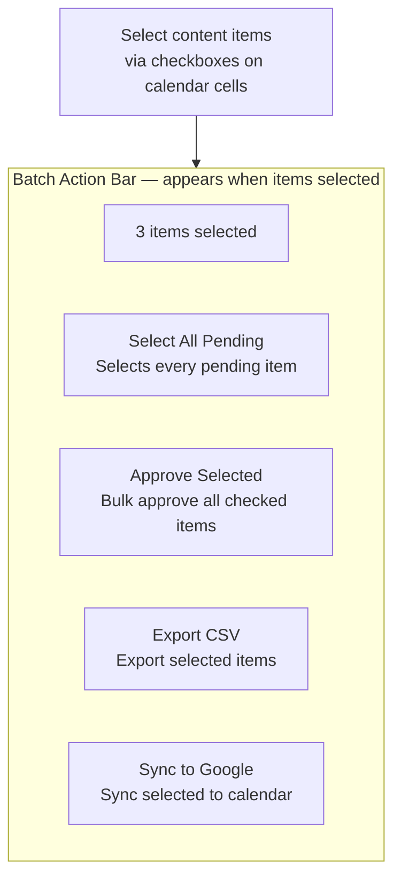

## Export & Sync Features

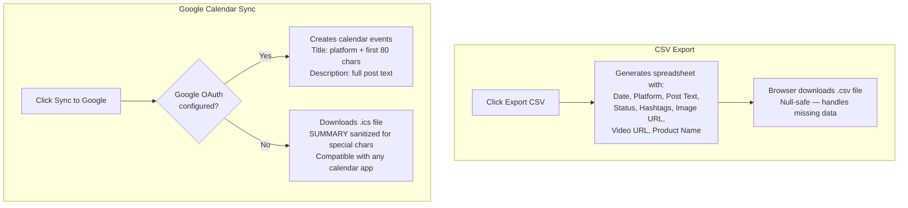

## Toast Notifications

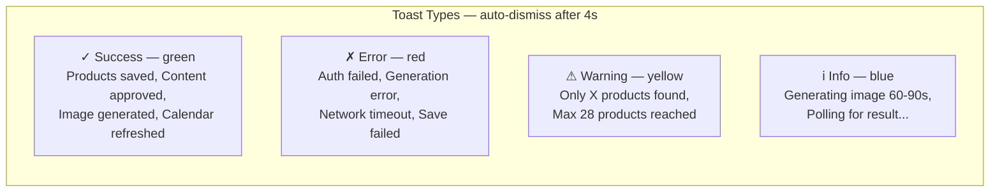

## Confirmation Dialogs

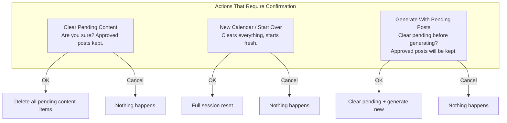

## Keyboard Shortcuts

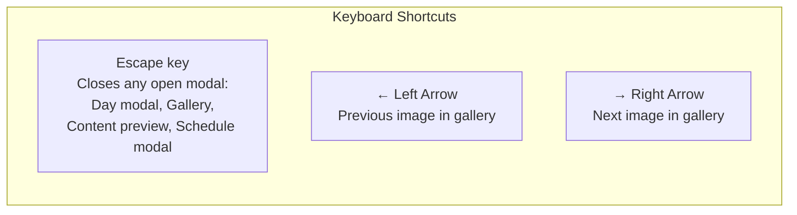

## Drag and Drop

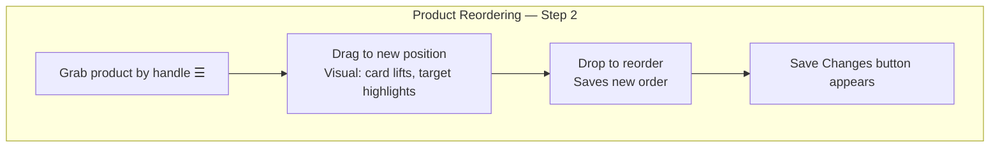

## Loading & Empty States

```mermaid
flowchart TD
    subgraph LoadingStates[Loading States]
        ICP[ICP Analysis — skeleton cards<br/>5 animated placeholder lines]
        Topics[Topic Generation — spinner<br/>Generating your topics...]
        Content[Content Generation — progress bar<br/>Percentage + phase indicator]
        Image[Image Generation — inline message<br/>Generating image... 60-90 seconds]
        Video[Video Generation — inline message<br/>Generating video... may take minutes]
        Calendar[Calendar — Loading weekly themes...]
    end

    subgraph EmptyStates[Empty States]
        NoICP[Step 2: Complete Step 1<br/>to discover your products]
        NoProducts[No products: empty state card]
        NoTopics[Generate 7 daily content topics<br/>for this week]
        NoContent[Generate content in Step 3<br/>to review it here]
        NoImage[No images yet. Click Generate Image<br/>to create an AI image for this day]
        NoVideo[No video yet. Click Generate Video<br/>to create a video for this day]
        NoCalContent[No content scheduled — Empty]
    end
```
